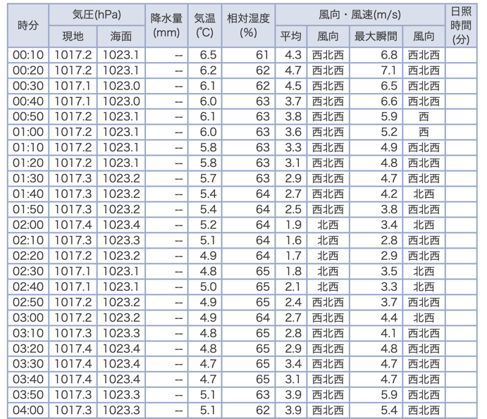

# 気象庁からデータをスクレイピングする.
[このサイト](https://www.data.jma.go.jp/obd/stats/etrn/index.php)をスクレーピングしてデータをどこかに永続化する.

## そもそもAPI公開されてないの?
2023/01/05現在, いいAPIは見つかりません.


## csvでダウンロードできるみたいだけど?
できますが, URLが不明なのとダウンロードされてくるcsvがdirtyです.また1時間が最小のデータ取得感覚なので、データの粒度が粗いです.
https://www.data.jma.go.jp/obd/stats/etrn/index.php 
こちらは10分ごとで取れる.

## 目標
**ある1日**における **10 分**ごとの**静岡県**, **浜松**の気象情報を抜き取る.
### 具体的にページのURLを眺めてみる
[ページ例](https://www.data.jma.go.jp/obd/stats/etrn/view/10min_s1.php?prec_no=50&block_no=47654&year=2023&month=01&day=01&view=p1)
```text
https://www.data.jma.go.jp/obd/stats/etrn/view/10min_s1.php?prec_no=50&block_no=47654&year=2023&month=01&day=01&view=p1
```
おそらく
1. 10分ごと: `10min_s1`
2. ある1日:   
   例えば 2023年1月1日の場合 -> `year=2023&month=01&day=01`  
3. 静岡県: `prec_no=50`
4. 浜松: `block_no=47654`

### 他に気にになる部分パラメータ
- クエリパラメータの `view=p1`ってなんだ?  
- 試しにp2にしてみる  
[クエリパラメータp2の場合](https://www.data.jma.go.jp/obd/stats/etrn/view/10min_s1.php?prec_no=50&block_no=47654&year=2023&month=01&day=01&view=p2)
-> 全く変わらないページにアクセスされる.

- `view=p1`なしにする...  
https://www.data.jma.go.jp/obd/stats/etrn/view/10min_s1.php?prec_no=50&block_no=47654&year=2023&month=01&day=01  

- -> 変化なし.
- viewパラメータはデータ量が多すぎるときのページング用と考えて良さそう.
- 今回の場合はデータ量がもともとわかっているので, viewパラメータはなしにする.

### ほしい部分

